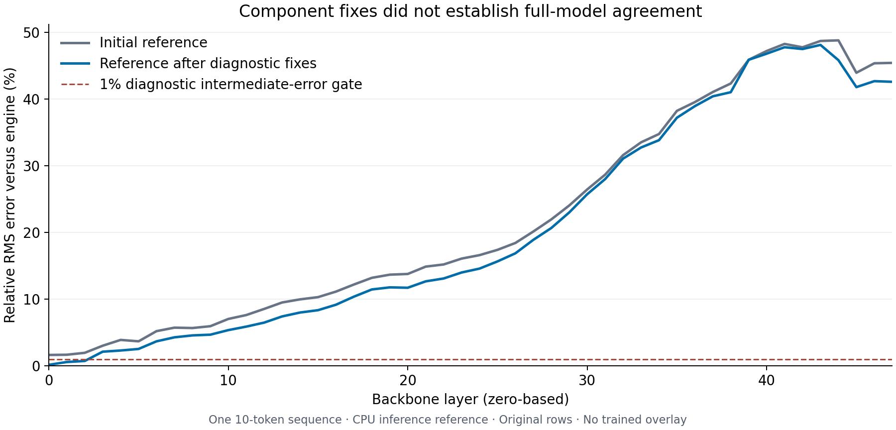

# Ngramma

**Research into making Flash Next more reliable by refining its existing n-gram memory.**

The project begins with [handoff.md](handoff.md), its original research specification. The central question is: **can a task the model already solves with a useful reminder become more reliable without that reminder after training a sparse subset of its existing memory rows?**

The intended result is the original frozen model plus a small, versioned memory overlay. A teacher diagnoses failures and supplies independently verified corrections during improvement cycles. A numerical optimizer changes selected existing rows; the backbone, tokenizer, memory reader, and gates stay frozen. Ordinary inference and the primary evaluation use no teacher or extra lesson text.

**Latest result:** [twelve instruction-memory edits](experiments/006-instruction-memory/REPORT.md)
were tested on 288 generated answers. The best two each fixed two development
failures and broke two correct controls. **None passed the fixed acceptance
rule; no overlay was accepted or tested on holdout.** The preceding
[format-reminder benefit](experiments/005-behavior/REPORT.md) remains a prompt
result, not an improvement retained through these memory edits.

The memory-edit workbench measures 19 edits of one existing
row, with eight fresh full-engine controls. Small edits vanish at the activation
quantizer; the first surviving samples change scale bytes while integer codes
stay fixed, and alter downstream token rankings.
[Read experiment 004](experiments/004-row-response/REPORT.md).
The [preceding forward checks](experiments/003-attention/REPORT.md) match the CPU
engine bit-for-bit through all 48 layers and logits on 39 tested tokens.

This repository follows that research program independently of any particular host or orchestration setup. The handoff is preserved as the design record. Its proposed components and milestones are not claims of completed implementation.

## Try the memory-edit workbench

[Download the complete offline report](https://github.com/crogers2287/ngramma/raw/refs/heads/main/experiments/004-row-response/workbench.html)
and open it in a browser, or generate it from the recorded data:

Explore measured row edits in an interactive, offline report. Python 3.10+ is
enough; these commands need no model, GPU, API key, or Python dependencies:

```sh
PYTHONPATH=src python3 -m ngramma_runtime.response_report \
  experiments/004-row-response/response-with-engine.json --html .local/row-response.html
```

Open `.local/row-response.html`. The tables and toggles show which edits survive
quantization, how memory outputs change, and full-engine prediction changes
when supplied. The first real experiment changes one existing 160-value row:
several small edits vanish at the activation quantizer, while the first changed
sample alters scale bytes without altering integer codes. A smooth derivative
passes its own check but does not predict every measured native response.

Use the [JSON example and schema](examples/memory-edit-workbench/README.md) to
report experiments from your own implementation, build on the
[checked row-patch utility](src/ngramma_runtime/row_patch.py), or use the
[model-free overlay inspector](examples/memory-edit-workbench/README.md#inspect-an-overlay-without-a-model).
The [portable row tracer](examples/row-addresses/README.md) also shows which
global memory rows a saved prompt and decoded history address, without loading
weights or installing NumPy/Torch. Multirow export is available through
[MultiRowPatch](src/ngramma_runtime/multi_row_patch.py).
See the [fixed experiment plan](experiments/004-row-response/PLAN.md) and
[reproduction instructions](experiments/004-row-response/REPRODUCE.md).
These are research tools; no trained overlay or capability improvement is
being released.

See [CONTRIBUTING.md](CONTRIBUTING.md) for adding another backend, collecting
new row-response evidence, or designing a verifiable behavior experiment.

## First experiment: September 7, 2026

**Existing-row overlays worked in the tested CPU engine, but the sequence-training replica failed numerical agreement. No learned improvement was demonstrated.** The first experiment reached overlay interception and numerical diagnostics; it did not qualify a training run.

| Question | Observed result |
|---|---|
| Can the engine load an overlay without changing baseline outputs? | Yes: empty and original-row controls gave bit-identical logits over 39 CPU-tested tokens. |
| Does offline addressing match the engine? | Yes: 624 row accesses per traced condition matched. |
| Does an actual row change reach inference? | Yes: a diagnostic perturbation changed the intended gathered value and logits. It was not an improvement test. |
| Does the differentiable replica match inference? | No: the corrected reference agreed on the top token at 9/10 positions; maximum selected-token log-probability error was 1.803 nats. |
| Did reminders expose a repeatable weakness? | Not established: 19/20 versus 20/20 initially; the failed case then passed 3/3 both with and without a reminder. |
| Was a learned overlay released? | No. Forward agreement and real-model gradient checks remain unresolved. |

[Read the findings](REPORT.md) · [Progress against the handoff](docs/research-status.md) · [Inspect the evidence](data/README.md) · [Reproduction limits](REPRODUCIBILITY.md) · [Reference source](reference/README.md)



The graph shows one 10-token sequence. Lower component errors did not eliminate disagreement through the full model.

## Check the published evidence

Python 3.10 or newer; no model, GPU, API key, or third-party Python package is needed:

```sh
git clone https://github.com/crogers2287/ngramma.git
cd ngramma
python3 scripts/verify_results.py
python3 experiments/006-instruction-memory/verify_results.py
```

The first command checks file hashes, replays the original 47 mock-tool episodes, and checks numerical-report consistency. The second re-scores the instruction-memory candidates, checks zero controls and artifact bindings, and reapplies the fixed improvement/retention rule. **These checks do not rerun model inference or independently reproduce saved tensor comparisons.**

To regenerate the figure:

```sh
python3 -m pip install -r requirements-figures.txt
python3 scripts/plot_results.py
```

## Research status

[Experiment 003](experiments/003-attention/REPORT.md) now matches the CPU engine
bit-for-bit through all 48 layers and every output logit on the original,
Unicode/chat, and repeated-EOS fixtures. Native rotary arithmetic, padded
attention, preservation of query memory layout, and a memory-gate scalar
correction resolve the measured discrepancies. Original-sequence error falls
from experiment 002's 0.906 nats to zero. The wider failed controls remain
published alongside the corrections. The
[forward diagnostic harness](docs/runtime.md) has no backward
implementation; no rows have been trained.

The initial prototype recorded 22 guard and plumbing tests passing; these were not real-model gradient validation. Later experiments add finite row edits and real generated-answer evaluation. No teacher-generated corrections have been used to train selected rows, and no learned overlay has qualified.

Broader execution coverage and directional-gradient qualification remain
prerequisites to gradient training. A repeated format-reminder benefit now
provides a narrow behavioral target; a qualifying content-reminder rescue and
broader independent-family evaluation remain open. See
the [source audit](docs/source-audit.md), [architecture audit](docs/architecture-audit.md),
and [experiment protocol](docs/experiment-protocol.md).

## Attribution

This work builds on [ENGRAFT](https://github.com/fulvian/engraft-ngram/tree/028129c9c5c50fddb09b1503f6ccae07349b9831) and a [llama.cpp fork](https://github.com/LaurentZuijdwijk/llama.cpp/tree/5e085d123eead2e89b5c19f824fccb05727da6a2). Our checkpoint layout, engine, and experimental objective differ from ENGRAFT's reported fact-grafting experiment; our parity failure is specific to the configuration tested here.

The implementation and report were prepared with AI assistance. Results are tied to saved artifacts; the central hypothesis remains unresolved. See [NOTICE](NOTICE) for source attribution and [CITATION.cff](CITATION.cff) to cite this research snapshot.
