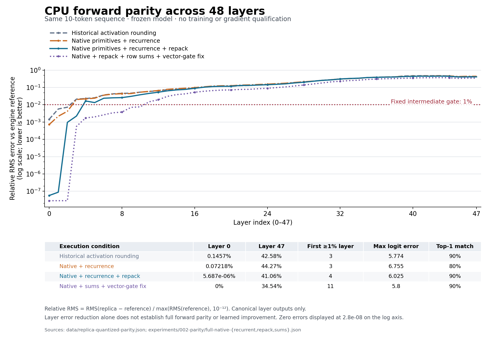

# Experiment 002: locating numerical disagreement

**The first three layers now match bit-for-bit on the original ten-token
CPU fixture. Full-model controls still fail. No rows were trained.**

The objective remains the [handoff](../../handoff.md): make guided capabilities
more reliable through changes to selected existing memory rows. This experiment
works on the prerequisite that the optimization computation must agree with
inference. Historical experiment 001 files remain unchanged.

## Measurements so far

All comparisons use the same checkpoint identity and ten tokens as experiment
001. Relative RMS is a ratio: 0.001 corresponds to 0.1%. Exact-input component
checks replace only a component's input with saved engine values; chained checks
propagate the replica's own preceding output.

| Forward implementation | First HC mix relative RMS | Complete layer 0 relative RMS | Full-model selected-token log-probability error | Top-token agreement |
|---|---:|---:|---:|---:|
| Historical activation-roundtrip control | 7.03e-8 | 0.00145665 | 1.80264 nats (experiment 001) | 9/10 |
| Native unary/norm and raw-buffer matrix operations | 0 | 0.000947788 | Not run | Not run |
| Also native convolution and fused recurrence | 0 | 0.000721832 | 2.70391 nats | 8/10 |
| Also loader-style CPU weight repacking | 0 | 5.68707e-8 | 1.05851 nats | 9/10 |
| Also native row sums/vector gate, intermediate registry control | 0 | 0 (bit-identical) | 0.816762 nats | 9/10 |
| Final: row sums/vector gate with stale-entry handling fixed | 0 | 0 (bit-identical) | 0.905555 nats | 9/10 |

The final control finishes with relative RMS 0.345406 at layer 47 and
first crosses the intermediate gate at layer 11 (zero-based). It fails
both unchanged exploratory gates: selected-token log-probability error below
0.02 nats and intermediate relative RMS below 0.01. A lower first-layer error is
not evidence that downstream agreement improves.

The final selected-token error is approximately half the experiment-001 value,
but remains far above the 0.02-nat gate. Top-token agreement stays at 9/10. These
are numerical diagnostics on one sequence, not model-quality improvements.

The native bridge is **forward-only**. It is a diagnostic instrument, not an
autograd implementation, sequence trainer, or accepted improvement to Flash Next.
The adapter explicitly refuses gradient-enabled use. No teacher corrections,
learned overlay, unseen-task improvement, or gradient qualification occurred.

## What the additional captures establish

The initial control reproduces the historical complete layer-0 error. Expanded
captures include both HC normalizations, gates, injections, and combines.
Native normalization, nonlinear operations, and matrix calls make every first
HC stage bit-identical; the second mixer and both combines are also exact when
given exact reference inputs. This closes gaps in the earlier component probe,
which did not test these complete paths.

The pre-repack attention trace locates its first residual error in Q4_0 QKV and gate
projections. QKV relative RMS is 1.58e-7 from exact input. Alpha, beta, softplus,
and decay are exact. The final attention projection differs by 1.02222e-5 at its
worst element. The remaining small difference grows in the following mixer and
expert computation.

Fixture-only tests show that one-ULP changes can cross activation-quantization
thresholds: a maximum 4.77e-7 input perturbation changed 64 rounded values by up
to 0.000968933. This demonstrates sensitivity, not a measurement of how much of
the actual chained error those crossings explain. Native sigmoid reproduces the
captured combines exactly where Torch sigmoid does not. See the
[independent code review and fixture records](review/numerical-review.md).

Source inspection identifies CPU weight repacking as a concrete
dispatch difference. The original native bridge sets raw weight bytes; a loaded
engine can attach CPU_REPACK buffers and choose packed GEMM/GEMV kernels. The
new optional repack entry point reports the buffer it selects. A direct engine
capture now confirms that `blk.0.attn_qkv.weight` uses CPU_REPACK, while the HC
weights use CPU_Mapped. The expanded lens preserves the historical logits
bit-for-bit. Enabling loader-style repacking makes the complete attention output
exact and leaves only a small MoE discrepancy. The repack full control improves
selected-token error from 2.704 to 1.059 nats but still fails both gates.

Two uncovered operations remained in the first-layer MoE path:
the routing denominator used a Torch float32 sum where the engine accumulates
into double, and the shared-expert gate's vector weight bypassed the native
matrix registry. Native row sums and vector-weight dispatch together make every
captured first-layer stage exact, including the complete 102,400-value residual.
Routing indices also match. This is a same-fixture forward result, not evidence
of generalization, a learned overlay, or a valid backward pass.

The first full run with those changes stopped at a validation bug: its new shape
guard rejected the valid empty PLE convolution history at sequence start. The
guard now accepts short histories and explicitly left-pads them before native
dilation-1 calls. Dilated convolution retains the original implementation.
`aborted-sums-probe.json` records that incomplete run; it is not a full-model result.

The first completed sums run still had two vector projections outside the native
path. Expired matrix registrations could occupy a reused address and hide a
live vector weight. A dedicated regression fixture checks this case. The final
run records all 48 shared-gate vector projections, zero unregistered matrix/vector
calls, and no source changes during execution. Its error is **0.905555 nats**;
the earlier 0.816762-nat result is retained in
`full-native-sums-stale-registry.json` and is not substituted for the final result.

## Evidence and reproduction

The JSON files alongside this report preserve controls and failed trials:
`operator-probe.json`, `operator-probe-native-all.json`,
`operator-probe-native-recurrent.json`, `attention-native-recurrent.json`,
`operator-probe-native-repack.json`, `operator-probe-native-sums.json`, and the
`full-native-*.json` controls. They contain numeric summaries, source/library
identities, and qualification status. The initial full control's source-hash
scope is explicitly marked: source files evolved during that run; its loaded
native library is pinned by its binary hash. Later probes snapshot source files
before initialization and include build records. Raw model-derived tensors stay
local and are not redistributed.

[Runtime instructions](../../docs/runtime.md) and the
[exact diagnostic commands](REPRODUCE.md) describe dependencies and reruns.
`scripts/capture_reference.py` captures CPU tensors in a
new directory. `operator_probe.py` compares the first layer, `attention_probe.py`
isolates its recurrent attention, and `full_probe.py` compares all 48 layers and
logits. The optional lens records ancestor weight-buffer names without exporting
weight bytes. Compilation and synthetic tests do not qualify a fresh full-model
build.

Each model process runs separately on CPU, with a bounded decoded-weight cache,
four replica threads, and a 900-second process limit. Existing inference services
are not modified. The full native-recurrent control took approximately 151 seconds
for the forward after initialization; this is inference diagnosis, not a training
speed measurement. Its process peak RSS and initialization time are recorded in
the result JSON. Training remains closed pending numerical and gradient evidence.

The repack control used approximately 15.0 GiB peak process RSS and 166 seconds
for its forward after initialization. Neither number estimates backward-pass
cost. Installed Python/package versions are recorded in `environment.json`.
The final sums/registry control used approximately 15.0 GiB and 140 seconds for
its forward. Runs share OS caches and are not controlled cold/warm speed trials.
The read-only external ENGRAFT and GGUF Python source trees are hashed in
`external-source-identity.json`. The intermediate sums implementation is
recoverable through [its hash-checked patch](patches/README.md).
Public CI verifies archive integrity, saved metric consistency, and lightweight
configuration tests. Native fixtures require the separately supplied libraries;
their successful local execution is distinct from CI's explicit skips.
The final local suite passed 98 checks: 9 configuration tests, 67 native bridge
fixtures, and 22 adapter fixtures. Without configured research dependencies,
CI passes the 9 configuration tests and explicitly skips the 89 native fixtures.

## Remaining gate

The completed sums control has exact outputs through layers 0–2, including the
memory-bearing layer, and its first difference is at layer 3. That is the first
full-attention layer in this checkpoint. The next experiment should feed the
exact layer-2 output into layer 3 and compare normalization, rotary position
operations, attention scores/probabilities, and value aggregation before its
output projection and expert block. The current measurements locate a layer;
they do not yet isolate the operation responsible inside it.

Broader Unicode, delimiter, multi-turn, packed-sequence, long-context, GPU,
gradient, and behavioral-improvement qualification remain outstanding. The
native bridge's exact early-layer forward values supply no backward derivative.
The handoff's central hypothesis remains untested.
