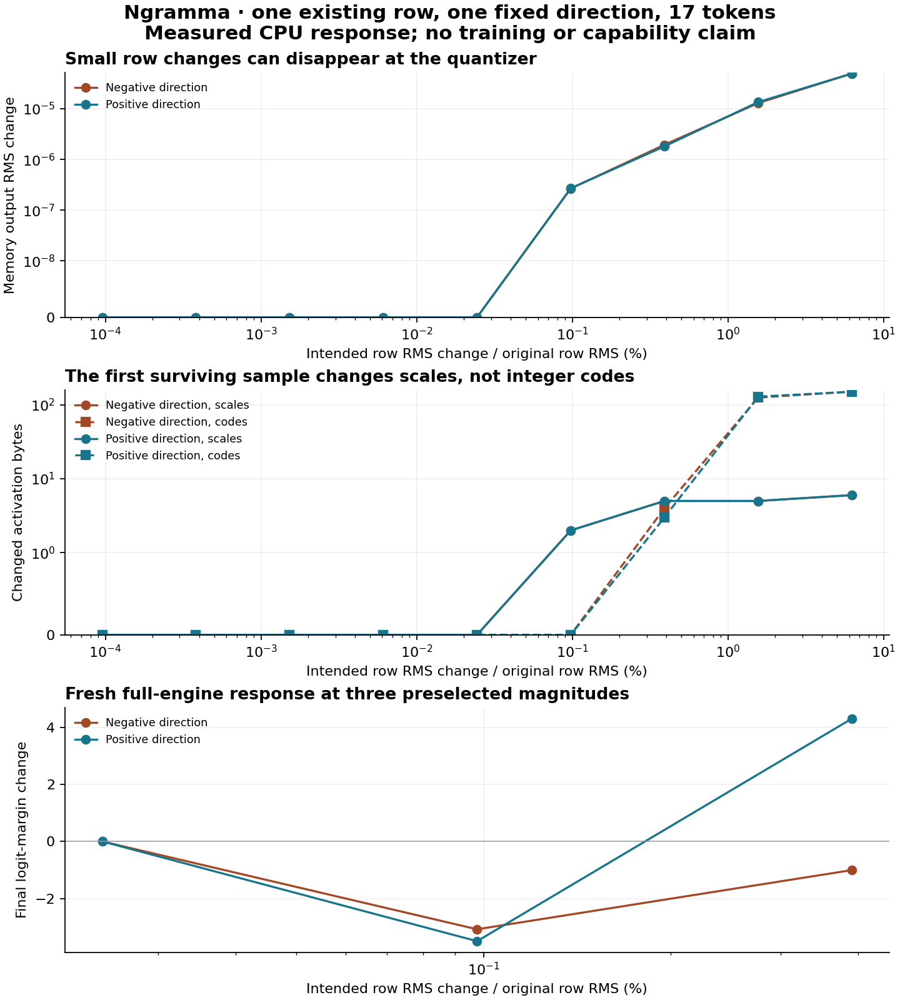

# A memory edit can disappear before it reaches the model

We changed one existing 160-value trigram row in Flash Next. At several small
step sizes, all 160 replacement values changed, yet the memory projections
and memory output stayed exactly the same. The CPU activation quantizer rounded
those changes away. At the first changed sample, only scale bytes changed;
the integer codes did not.

This is useful when building memory editors: a mathematically valid smooth
gradient does not establish that the proposed update reaches the deployed
quantized model. The accompanying workbench measures that distinction. This
experiment does **not** demonstrate improved answers or a trained overlay.

## What ships

The [offline explorer](../../examples/memory-edit-workbench/README.md) turns a
small JSON record into an interactive HTML report with exact tables and
toggleable plots. It needs only Python's standard library. The
[row-patch utility](../../src/ngramma_runtime/row_patch.py) applies one existing
row replacement at every matching address, preserves the original checkpoint,
and exports the format accepted by the experimental engine loader. NumPy is
needed for that utility; the native probe additionally needs the pinned model
and runtime dependencies.

The [local response](response.json), [complete engine comparison](response-with-engine.json), [fixed plan](PLAN.md),
[activation source audit](review/activation-encoding-audit.md),
[independent numerical review](review/response-audit.md), and
[reproduction commands](REPRODUCE.md) are included. All eight full-engine checks
finished. The local-only record is preserved separately from the engine evidence.
The [standalone HTML report](workbench.html) is also included; download it and
open it locally. Its content is checked against the measured JSON in CI.

## Controlled local result

The experiment uses the exact 17-token Unicode/chat CPU fixture qualified in
experiment 003. It selects head 8's existing trigram row at token index 6, global
address `163155024`. That row occurs once in this fixture. The code supports
all matching occurrences; repeated occurrences are covered by utility tests,
not by this real-model fixture.

The direction alternates positive and negative coordinates, scaled by the
original decoded row's RMS. It was fixed before edited forwards, with no search
for a favorable direction. A separate local specification fixes the final
logit-margin token IDs before any full-engine perturbation. All other row
values and model weights remain fixed.

| Absolute epsilon | Intended row RMS change | Local observation, both signs |
|---|---:|---|
| 2^-20 through 2^-12, five sampled magnitudes | 0.0000954% through 0.0244% | All 160 replacement values change; encoded bytes, projections and memory output do not. |
| 2^-10 | 0.0977% | Two activation scale bytes change, zero code bytes; key/value projections and memory output change. |
| 2^-8 | 0.3906% | Scale and code bytes change; memory output changes further. |
| 2^-6 and 2^-4 | 1.5625% and 6.25% | Larger finite memory-output responses. |

These are sampled points, not a proof of a continuous flat interval or an exact
threshold. Epsilon is normalized row displacement, not a percentage of model
parameters. The native PLE baseline matches the engine capture exactly before
perturbations. The activation bytes are a replay of the actual dispatched
encoder on the exact gathered inputs, **not** captured engine workspace.

Both PLE projections use Q8_0 in ordinary CPU_Mapped buffers. Each 32-value
activation block has an FP16 scale and 32 integer codes, totaling 34 bytes.
This is why watching only integer codes misses the first measured change.
The [activation build record](activation-build.json) binds the encoder to the
same CPU libraries used by the native forward reference.

A [more detailed replay](review/scale-transition-final.json) finds two distinct
FP16 scales changing by one representable step each. In block 40, the two edit
directions move the scale in opposite directions. In block 41, both edits raise
the scale: two positive values tie for the largest absolute value, at
coordinates 0 and 31. The alternating edit raises coordinate 0 in one direction
and coordinate 31 in the other. All integer codes stay unchanged.

Thus opposite row edits produce encoded changes that are not opposites. This
explains an asymmetry in the quantizer; it does not isolate each block's
contribution through projection weights and nonlinear operations to the final
scalar response. Earlier scale records are retained; `scale-transition-final`
is the complete replay with maximum locations and baseline encoding hashes.

## What happened in the full engine

Eight fresh CPU processes tested the unmodified model, a zero overlay, and both
directions at three magnitudes selected by the fixed local-response rule.
Normal expert routing and attention selection ran in the actual engine.
The gathered row replacements and full PLE outputs match the local probe;
the earlier layer0 residual remains unchanged. No captured attention-support
substitution was used for these perturbed engine runs.

| Condition | Logits byte-identical to baseline? | Same highest-scoring token, out of 17 positions | Final fixed-margin change |
|---|---|---:|---:|
| Unmodified model | Yes | 17 | 0 |
| Zero overlay | Yes | 17 | 0 |
| -2^-12 | Yes | 17 | 0 |
| +2^-12 | Yes | 17 | 0 |
| -2^-10 | No | 14 | -3.077259 |
| +2^-10 | No | 16 | -3.493896 |
| -2^-8 | No | 16 | -1.004133 |
| +2^-8 | No | 16 | +4.301823 |

The final-position margin compares fixed token IDs 248068 and 248045, chosen from
the unmodified top two before edited forwards. Its baseline value is 8.437328.
The highest-scoring token **at the final position stays unchanged in every
condition**. Changed rankings occur at other evaluated positions; these are
prefill logit comparisons on fixed input tokens, not an autoregressive rollout
or generated-answer accuracy test.

At the first changed magnitude, both directions reduce the final margin. At
the next magnitude their margin changes have opposite signs. Thus neither a
smooth local derivative nor edit magnitude alone establishes the direction or
size of the eventual full-model response. The local derivative below uses a
different scalar and cannot be directly compared numerically with this margin.

Lines connect sampled steps for comparison; intermediate responses were not
measured. The local scan took about 43 seconds. Engine controls include complete
model-shard verification on each overlay load, which dominated their roughly
four-minute runtimes. These are not decode-throughput or training benchmarks.

## The smooth derivative passes its own test—and still differs

The independent smooth control uses FP64 PLE operations, dequantized frozen
weights, and no activation quantization. For the fixed local scalar
`PLE output[6,0,0]`, autograd gives a directional derivative of
`-0.00011579135462728632`. Central differences of **that same smooth function**
agree, with a best relative error of about `3.04e-11` on the fixed ladder.

The native quantized response is different. At `+2^-10`, the local scalar
increases by about `2.70e-8`; a first-order prediction from the smooth derivative
would decrease it. At `-2^-10`, it increases by about `2.56e-8`, which does
agree in sign with the smooth prediction. The symmetric native finite-step
secant is positive, about `7.15e-7`, while the smooth derivative is negative.

This is a local comparison of two named computations. It is not a full-model
gradient check, a proof that gradient-based editing cannot work, or evidence
that the same step size will work for another row. A useful optimizer may need
a surrogate gradient and an empirically justified finite update size; those
choices need deployment tests across more rows, directions, and tasks.

## How to build on it

Use the workbench to measure whether an edit survives the actual activation
format before investing in an optimizer. Record complete encodings, including
scales and any auxiliary fields; then test selected edits through the full
serving engine with fresh state and live routing. Do not substitute training
loss or a local projection effect for a task-success score.

The next scientific gate is a finite-update direction study across independent
rows and prompts, followed by an objectively graded behavior experiment with
preservation cases. No teacher-generated training data, optimizer step,
retention benchmark, task generalization result, or accepted overlay appears in
this experiment.
