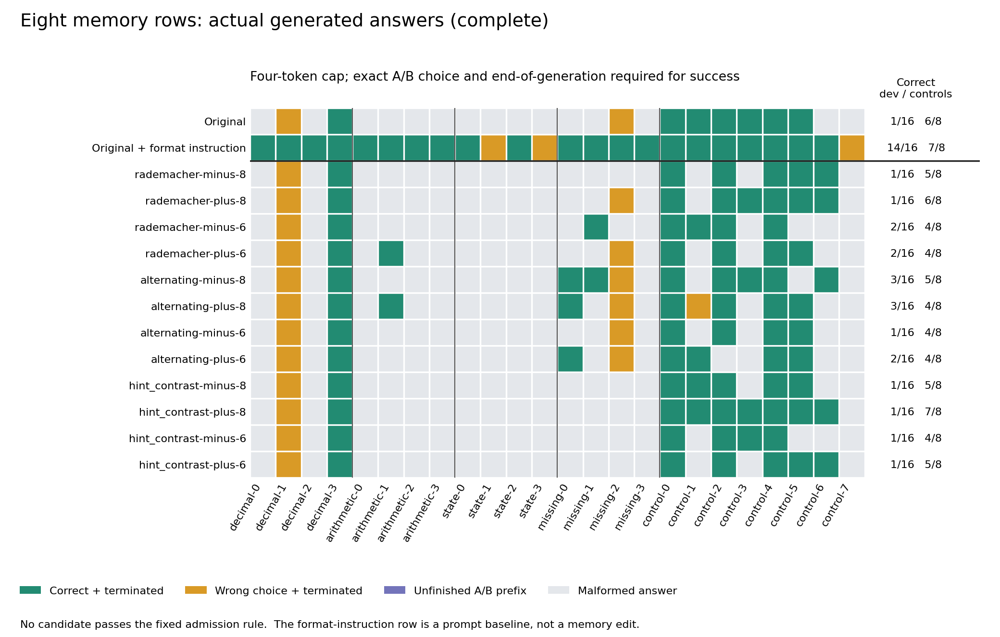

# Experiment 006: can a small memory edit retain a useful format reminder?

**All twelve candidates were rejected. Small memory edits changed real model
behavior, but none met the fixed improvement-and-retention rule. No overlay
was accepted, and the held-out inputs were not evaluated.**

The experiment changes eight existing memory rows, containing 1,280 FP32
values, while keeping the rest of the model and the ordinary prompts fixed.
It tests actual generated answers rather than selecting a favorable logit.
The objective is a narrow instruction-following improvement: give the correct
A/B answer, without an explanation, when the task requests that format.

## Why this target

[Experiment 005](../005-behavior/REPORT.md) found a repeatable prompt benefit:
the same 16 development tasks produced 1 correct complete answer with the
ordinary prompt and 14 with a stronger format instruction. Thirteen original
failures were malformed responses under the four-token contract. This was
not evidence that the model lacked the underlying arithmetic knowledge.
Its separate counting and state-replacement content hints did not qualify.

The ordinary model scored 6/8 on the controls; the stronger format instruction
scored 7/8 and retained all seven initially correct development/control
answers. That instruction is a prompt baseline, not a learned memory edit.
It is absent from every candidate's inference prompt.

## What changed

The selected observed token triple is `[15666, 1132, 357]`, the earliest
fully contained trigram of `Answer only A or B.`. Its eight trigram-head global
rows appear once each in all 24 original prompts. We explicitly allowed
instruction-related rows for this experiment; no chat-delimiter row, new table
entry, tokenizer value, backbone weight, router weight, or memory gate weight changes.

Three fixed directions were prepared before scores: SHA256-derived random
signs, alternating signs, and the mean of eligible same-head rows used by the
successful reminder minus each target anchor. That last direction is a
heuristic; averaging observed reminder rows does not establish that their
values encode the reminder's procedure. Each direction was normalized to the
original row's RMS and tested with signed magnitudes 1/256 and 1/64: about
0.39% and 1.56% relative row displacement. All twelve recipes and overlay hashes
were frozen before candidate generation.

The replacement values occupy 5,120 bytes. The first FML, including row IDs,
model identity and other metadata, is 9,951 bytes. Original decoded anchors,
FML payloads, and raw captures stay local; public recipes and hashes let a
researcher with the matching model reconstruct and check them.

This is finite candidate selection, with no numerical backward pass or
teacher-generated correction training. The earlier exact native forward
reference still has no qualified full-sequence gradient.

## Qualification and decision rule

The zero overlay reproduced all 24 baseline generations and selected scores
exactly. Its complete 17-token legacy logits also matched the earlier
reference. The zero and first finite lookup witnesses each cover 54 actual
input positions and 864 row accesses. Zero changes no values; the first finite
witness changes exactly the intended 1,280 values, and every unselected value
matches the original gather. These controls are in `zero-validation.json`,
`zero-lookup.json`, and `first-candidate-lookup.json`.

Each candidate receives the same 16 development tasks and eight controls.
Success requires the whole decoded answer to be the correct A/B choice,
apart from surrounding whitespace, and generation must end on EOG. A correct
letter followed by an explanation or an unfinished prefix is a failure. Greedy
decoding uses the full vocabulary, with no grammar or forced answer prefix.
Fresh sequence state is used for every task.

The predeclared admission rule requires at least two rescued development
failures, no loss of an initially correct answer, and no newly malformed or
unfinished answer on an initially well-formed, terminated response. Total
scores alone cannot conceal paired regressions. Only one selected winner may
receive fresh confirmation and then the 32 previously untested within-family
inputs. See [PLAN.md](PLAN.md) and [CONFIRMATION.md](CONFIRMATION.md).

## Outcomes

The completed search contains 288 scored candidate generations: 24 tasks for
each of twelve immutable overlays. The two best development scores are 3/16,
up from 1/16, but each loses two initially correct controls. No candidate meets
all admission conditions. The protocol therefore ends this round before
confirmation or held-out evaluation.

| Candidate | Dev correct | Controls correct | Dev rescues | Initially correct answers lost | New format/termination losses |
|---|---:|---:|---:|---:|---:|
| `rademacher-minus-8` | 1/16 | 5/8 | 0 | 2 | 3 |
| `rademacher-plus-8` | 1/16 | 6/8 | 0 | 1 | 1 |
| `rademacher-minus-6` | 2/16 | 4/8 | 1 | 2 | 3 |
| `rademacher-plus-6` | 2/16 | 4/8 | 1 | 2 | 2 |
| `alternating-minus-8` | 3/16 | 5/8 | 2 | 2 | 2 |
| `alternating-plus-8` | 3/16 | 4/8 | 2 | 2 | 1 |
| `alternating-minus-6` | 1/16 | 4/8 | 0 | 2 | 2 |
| `alternating-plus-6` | 2/16 | 4/8 | 1 | 2 | 2 |
| `hint_contrast-minus-8` | 1/16 | 5/8 | 0 | 1 | 2 |
| `hint_contrast-plus-8` | 1/16 | 7/8 | 0 | 0 | 1 |
| `hint_contrast-minus-6` | 1/16 | 4/8 | 0 | 2 | 3 |
| `hint_contrast-plus-6` | 1/16 | 5/8 | 0 | 2 | 3 |

In these labels, `minus-8` means a signed step of -2^-8; it is not an
eight-unit change. Initially correct losses and new format losses can overlap,
so those columns must not be added as if they represented separate tasks.

The [raw search result](search-results.json) contains every answer, stopping
status, selected scores, model/runtime hashes, and paired decision. The
[analysis](analysis.json) and [validation](validation.json) are reproducible
with the included model-free commands.

## What the result tells us

The two completed alternating 1/256 edits each rescue two development
failures, but each loses two previously correct controls. A smaller positive
reminder-derived edit retains all initially correct answers and fixes one
control; it rescues no development failure and makes one formerly well-formed
wrong answer malformed. These are different reasons to reject a candidate.

All four distinct tasks rescued anywhere in the search (three development
tasks and one control) have correct answer A.
Across candidate/task pairs there are 12 gains, all on A tasks, and 20 losses
of initially correct answers: 19 on B tasks and one on an A task. These reuse
the same 24 problems and are not independent samples. The stronger prompt
instruction improves both A and B tasks. This supports
checking answer-label bias before interpreting improved counts as instruction
learning; it does not prove that a selected row has one semantic meaning.
The test suite includes an always-A counterexample that scores 8/16 development
tasks yet fails preservation.

Seventeen candidate/task episodes start with the correct literal A/B token
and then fail the complete response contract. That makes first-token scoring an insufficient
acceptance test. `analyze_results.py` records these cases separately, along
with answer-label counts and paired gains/losses.

## Reusable tools and limits

The new [portable row tracer](../../examples/row-addresses/README.md) calculates
global addresses from saved token IDs and model metadata without loading
weights or importing NumPy/Torch. It matches all 624 addresses in the historical
39-token native reference, every selected instruction-row occurrence, and all
eight donor-row sets. Its installed CLI was tested in a clean environment.
`audit_addresses.py` calculates expected uses across complete saved histories;
it does not call these offline calculations new native measurements.
Across the original, zero, and twelve candidate conditions, those calculations
find all selected-row hits in the prompt instruction and none in the decoded
tokens. This is observed coverage of this assay, not proof of no collisions
elsewhere. See [the address audit](address-audit.json).

The [model-free evidence checker](verify_results.py) replays exact requests,
whole-answer grading, zero-control bindings, per-candidate authentication
records, and fixed selection. It cannot establish an artifact's historical
authenticity or recreate absent model outputs merely from consistent JSON.
The [code review disposition](REVIEW.md) records addressed gaps and the limits
of the completed independent review. A local run passed 630 tests with native
dependencies configured and none skipped; those synthetic tests are separate
from the actual-model candidate runs.

All runs use one CPU model process at a time, eight threads, context 128,
batch/microbatch 32, f32 caches, flash attention off, and a four-token completion
budget. Each process has a 900-second bound, 80-GiB RSS cap, and 24-GiB available
RAM reserve. A qualified optional loader extension hashes all three model
shards concurrently, retaining full-file SHA256, path, and size checks on every
overlay load; no authentication cache is used.

The twelve candidate processes took 4,150.2 seconds in total (69.2 minutes),
including 1,808.5 seconds of complete-file authentication. They collectively
hashed 838,284,271,872 model bytes. Peak candidate RSS was 67.0 GiB; the lowest
recorded host availability was 113.2 GiB. These are measured evaluation costs
on a shared host, not decode-speed or training-throughput benchmarks. Counting
the zero control and lookup witnesses, experiment 006 generated 314 episodes,
performed 28 tokenizer checks, and ran one 17-token legacy prefill.

The fixed budget is small: one observed instruction trigram, eight rows, three
directions, two signed magnitudes, four task families, and eight controls. Even
a qualifying result would not establish unrelated-task retention, unseen-family
generalization, GPU equivalence, or general intelligence improvement. The next
substantive experiment should optimize complete verified answers, balance
answer positions within matched problem pairs, and penalize preservation
failures. A gradient-based implementation first needs a qualified backward
path; the current native reference does not provide one.

[Reproduction commands and qualifications](REPRODUCE.md)
